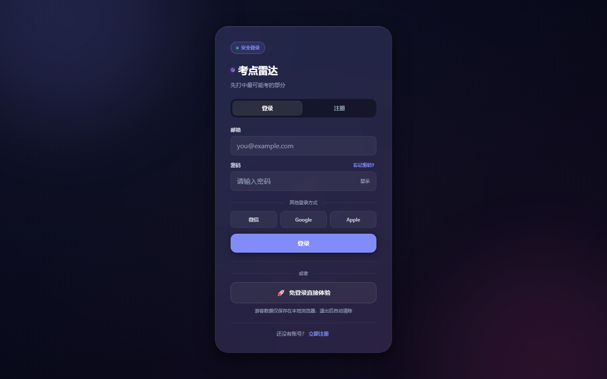
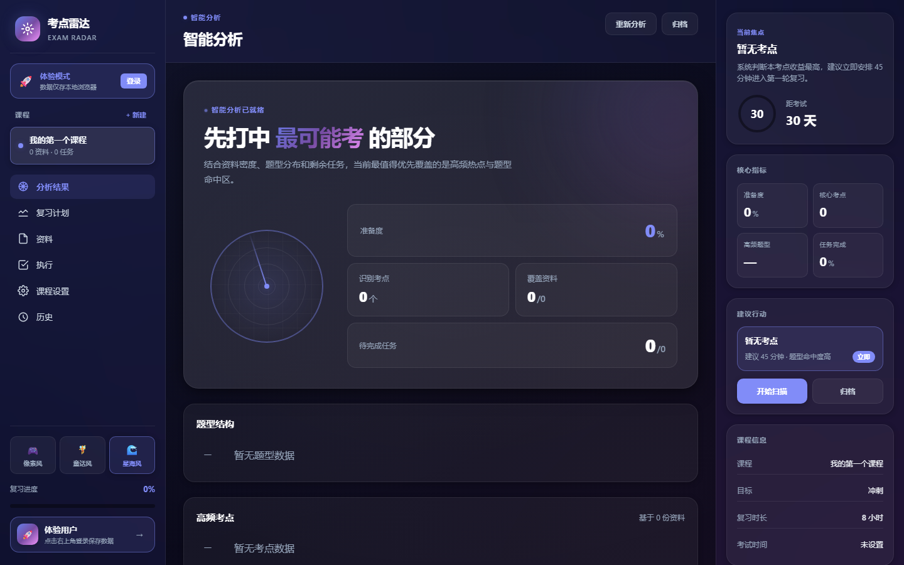
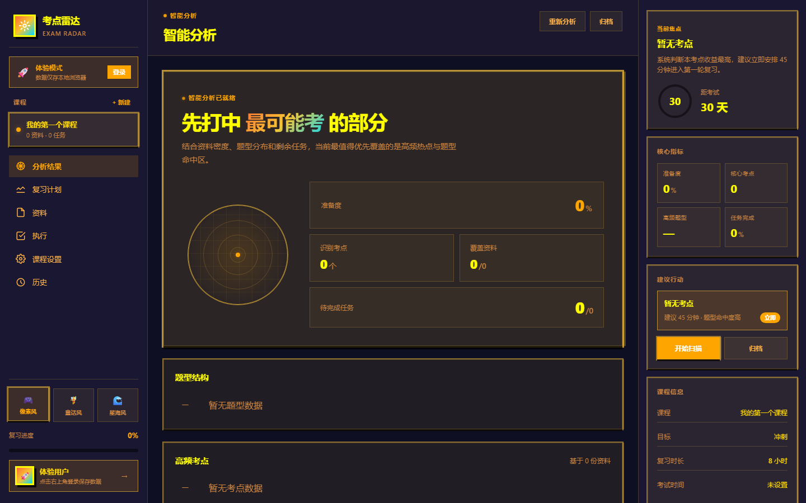
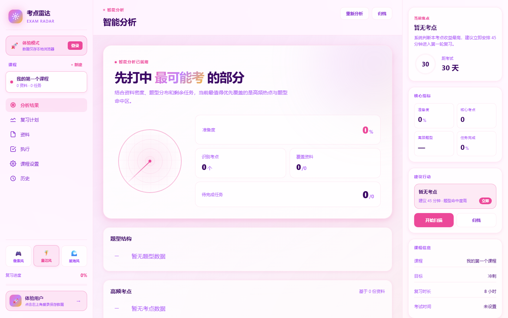
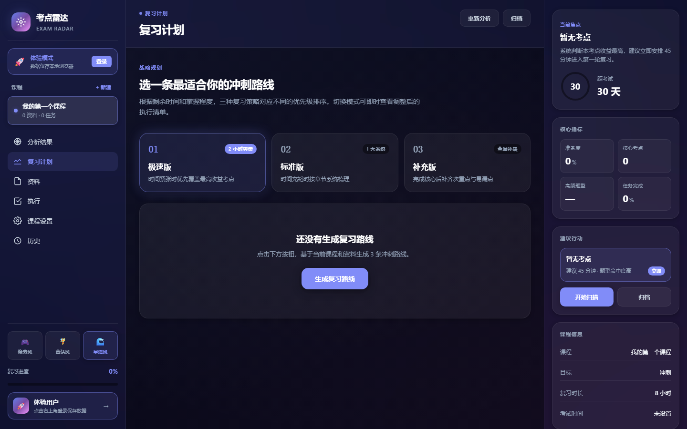
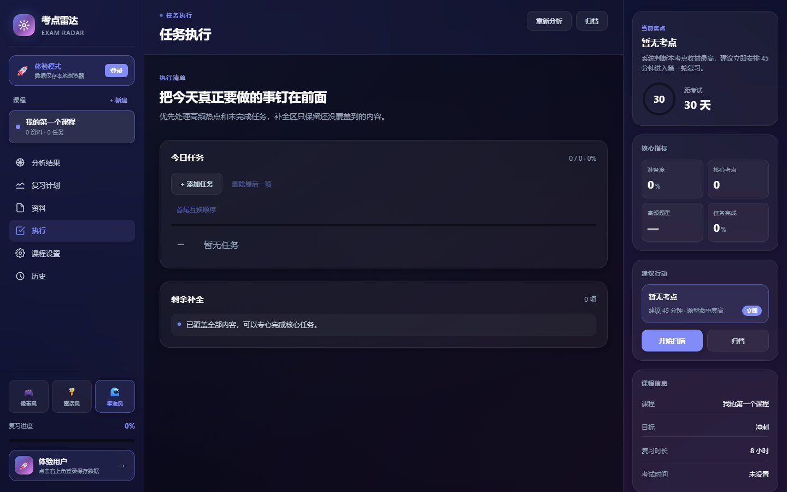

# 考点雷达 · 智能复习规划系统

> TRAE AI 创造力大赛参赛作品 — 学习工作赛道

## 🌐 在线体验

**公网地址（推荐）**：https://toxic-classes-multiple-education.trycloudflare.com

> ✅ 国内可直连，无需 VPN，无需登录确认页。
> 打开后点击「🚀 免登录直接体验」即可立即使用。

## 📸 项目截图

| 登录页 | 主界面（星海风） |
|---|---|
|  |  |

| 像素风主题 | 童话风主题 |
|---|---|
|  |  |

| 复习计划 | 任务执行 |
|---|---|
|  |  |

## 🎯 产品简介

**考点雷达 = 课程资料管理 + 题型考点雷达分析 + 智能复习路线生成**

面向大学生期末备考场景的 AI 复习分析工具。上传课程资料后，系统自动识别题型结构、知识点分布和高频考点，并根据剩余备考时间生成「极速版 / 标准版 / 补充版」三种复习方案。

## ✨ 核心功能

1. **课程容器**：围绕单门课程统一管理考试时间、剩余时长、目标、范围。
2. **资料资产层**：支持历年真题、老师课件、教材目录、考试范围、课堂笔记、指定习题六类资料管理。
3. **分析引擎**：根据已就绪资料推理题型结构、高频考点、来源依据，给出分析强度评分。
4. **计划生成层**：同一份分析结果按不同时间约束投影为极速版、标准版、补充版三种复习路径。
5. **学习执行层**：标记任务完成状态，自动联动剩余内容补全列表。

## 🎨 视觉设计

- **玻璃拟态 UI**：磨砂背景、backdrop-filter 模糊、柔和分层阴影、低饱和渐变、大圆角
- **三套主题实时切换**：
  - 🌊 **星海风**（默认）：深色专业，蓝紫渐变
  - 🧚 **童话风**：浅色清新，粉紫马卡龙
  - 🎮 **像素风**：8-bit 复古游戏风，硬边黄橙色
- **免登录体验**：游客模式无需注册，数据本地保存
- **响应式布局**：支持桌面 / 平板 / 手机三端自适应

## 🛠 技术栈

- **前端**：React 19 + TypeScript + Vite 8
- **后端**：NestJS + Prisma + JWT 鉴权
- **存储**：localStorage（游客模式）+ Prisma 数据库（注册用户）
- **部署**：Cloudflare Tunnel（公网 HTTPS）+ 一键启动脚本

## 🚀 本地启动

### 一键启动（推荐）

下载项目后：
- **Windows**：双击 `start.bat`
- **macOS / Linux**：运行 `bash start.sh`

### 手动启动

```bash
# 安装依赖
npm install

# 启动前端（端口 5173）
cd apps/web && npm run dev

# 启动后端（端口 4000）
cd apps/api && npm run start:dev
```

访问 http://localhost:5173

## 📁 项目结构

```
.
├── 01_报名资料/          # 大赛报名相关材料
├── 02_HTML创意产物/      # 报名阶段提交的 HTML
├── 03_项目文档/          # 产品需求文档、技术方案
├── 04_初赛交付/          # ⭐ 初赛作品帖文案 + 截图
├── 06_参考资料/          # 大赛要求速查
├── apps/
│   ├── web/              # React 前端
│   └── api/              # NestJS 后端
├── packages/shared/      # 前后端共享类型
├── start.bat             # Windows 一键启动
└── start.sh              # Mac/Linux 一键启动
```

## 📝 比赛帖文案

完整作品帖文案见 [04_初赛交付/考点雷达_初赛作品帖文案.md](04_初赛交付/考点雷达_初赛作品帖文案.md)

## 🏆 TRAE 使用情况

本项目完全使用 TRAE IDE 开发，包括：
- Agent 模式完成代码编写、调试、重构
- browser-use 技能进行 E2E 测试验证
- frontend-skill 技能完成 UI 重写
- code-reviewer 技能进行代码审查
- brainstorming 技能完成产品设计
- pua-trae 技能进行深度自检
- 一键全栈部署技能完成部署

---

⭐ 祝你期末稳过，考点尽在掌握！
